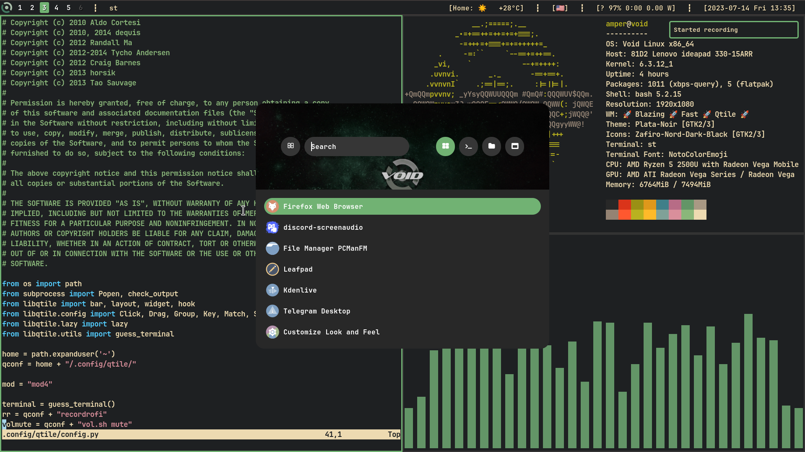

# Qtile rice

My Qtile configuration files.



## Dependencies
- `qtile` (Who would have thought?)
- `rofi` Application launcher
- `dunst` Notifications
- `feh` Wallpaper
- `pulseaudio-utils` Volume control
- `flameshot` Screenshotting tool
- `JetBrains Mono Bold` Main font
- Remove `pw` script from `./config/qtile/autostart.sh` if you're not using pipewire


## Installation

Don't worry, this script will create reserve copy of your old configuration files for dunst, qtile and rofi!
```bash
./install.sh
```
